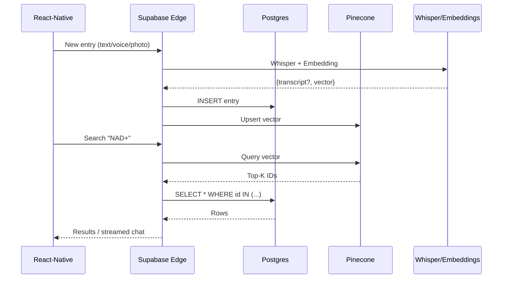

# LifeKB – Project Vision and Technical Blueprint

## Vision
LifeKB is a **lifelong memory companion**: a private, self-owned record of thoughts, events, and media that grows richer the more you use it. Over time it evolves from a simple journal into a personal knowledge base—a source you can query for insights, recall forgotten details, and observe long-term patterns in health, learning, and wellbeing. A well-crafted, longitudinal store of your life lets you learn from past decisions, spot correlations you would otherwise miss, and hand future-you the gift of accurate memory.

## Core Idea (MVP)
1. **Seamless capture** – type, dictate, or snap a photo and save in under ten seconds.
2. **Immediate enrichment** – each new entry is transcribed (if audio), embedded as a vector, tagged with metadata, and stored.
3. **Natural retrieval** – ask questions in plain language or run a semantic search to resurface any moment.
4. **Data sovereignty** – raw text and media stay in your database; only anonymised embeddings live in the vector store.

## Chosen Tech Stack

### What is OpenAI Whisper?
> **Whisper** is OpenAI’s speech-to-text model. Feed it an audio file (e.g., a voice journal) and it returns an accurate text transcript. In LifeKB it enables hands-free dictation: the app records audio, the backend calls Whisper, and the resulting text becomes searchable like any typed entry.

| Layer | Technology | Purpose |
|-------|------------|---------|
| **Front-end** | React Native + Expo (free tier) | Cross-platform mobile delivery |
| **Backend** | Supabase Edge Functions (TypeScript) + Postgres | Auth, storage, relational queries |
| **Vector DB** | Pinecone **Serverless** | Fast, filterable similarity search |
| **LLM Layer** | OpenAI Assistants API | Embeddings, Whisper transcription, chat answers |
| **Storage** | Supabase Storage | Media files (audio, photos) |

## High-Level Flow
1. **Create** – User makes an entry in the app.
2. **Enrich** – Edge Function calls Whisper (if audio) ➜ gets transcript ➜ calls embeddings ➜ receives vector.
3. **Persist** – Function inserts a row in Postgres and upserts the vector in Pinecone, keyed by row ID.
4. **Retrieve** – For search, backend embeds the query, queries Pinecone, fetches matching rows from Postgres, and returns them or streams an Assistant chat response.

## Why This Matters
* **Memory externalisation** – frees cognitive load and reduces decision regret.
* **Pattern visibility** – multi-year trends in mood, sleep, or relationships surface only with consistent recording.
* **Future-proofing** – owning your history in open formats guards against platform churn.
* **Ethical AI** – local-first design and minimal data to cloud services respect user privacy while enabling powerful retrieval.

## Next Steps (Development)
| Weekend | Goal |
|----------|------|
| **1** | Set up repo, Supabase project, bare entry form |
| **2** | Add Whisper + embeddings, store in Pinecone |
| **3** | Implement semantic search endpoint and basic result list |
| **4** | Add chat interface using OpenAI Assistants + Pinecone tool |
| **5** | Polish UI, export feature, prepare Android APK |

---
*Built with ❤️ by ***Henry Allen***
